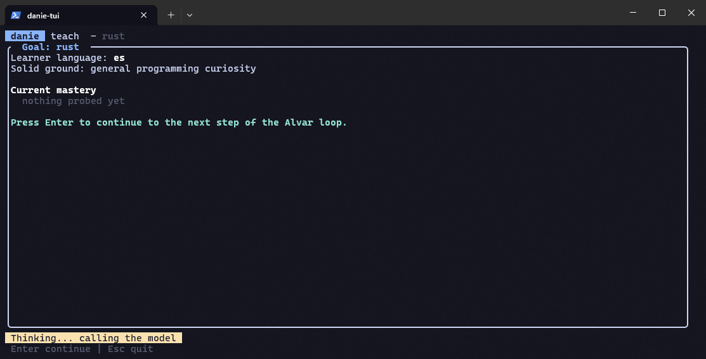
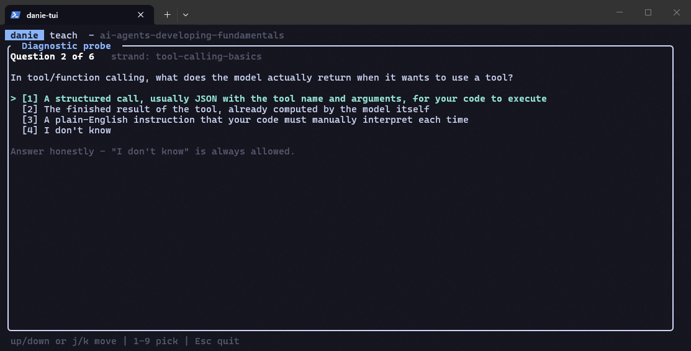
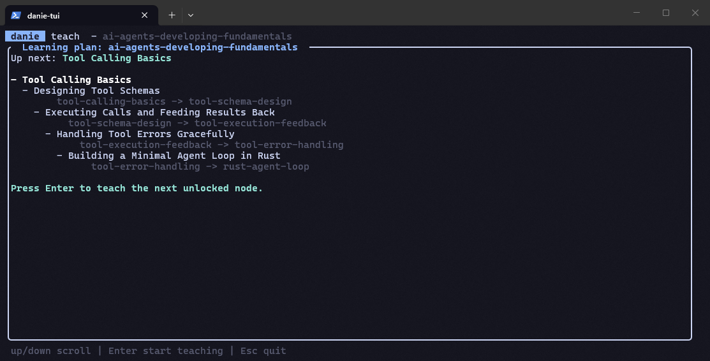
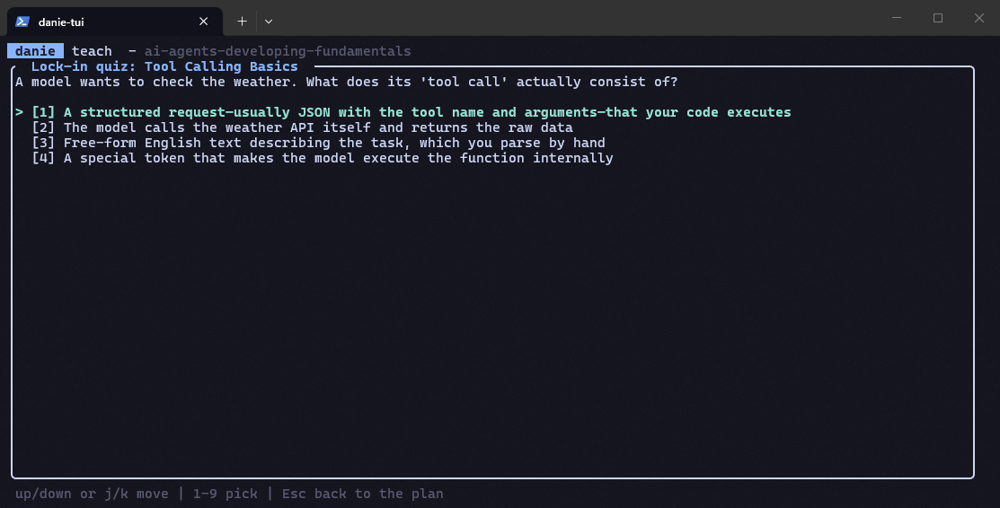
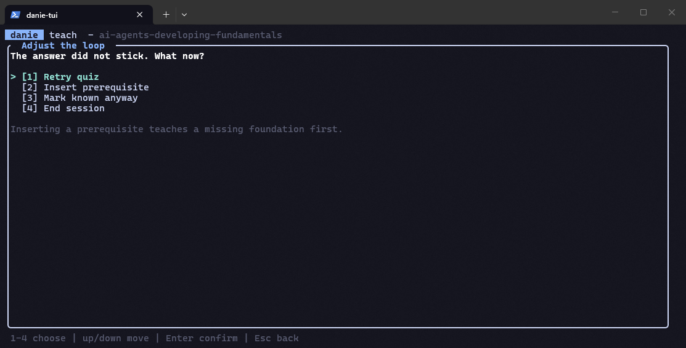
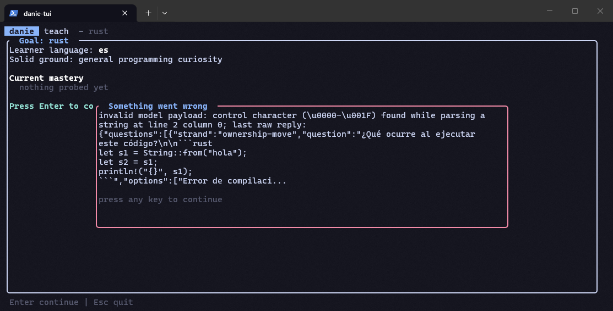

# danie

One-to-one AI tutor in your terminal. It probes what you already know, plans a
prerequisite DAG, teaches **one reasoning step at a time**, and locks every step
in with a quiz: the Alvar learning loop, implemented natively in Rust.



## Why danie

Most AI study tools are flashcard generators or PDF summarizers. danie is a
tutor that adapts to *you*:

- **No source material required.** Name any topic and danie plans the course.
  Other tools (alix, scathach, quizzer) start from documents you already have.
- **Prerequisite-aware.** It builds a dependency DAG of micro-topics and, when
  you fail a lock-in quiz, it diagnoses the missing foundation and inserts a
  new node into the plan. The curriculum repairs itself around your gaps.
- **One step at a time.** Each turn introduces exactly one idea and checks it,
  instead of dumping a wall of text.
- **Your data stays yours.** Progress lives in plain markdown and JSON inside
  `.danie/`. Open it with Obsidian, version it with git, edit it by hand.
- **Any provider.** Anthropic, OpenRouter, Ollama, LM Studio, or any
  OpenAI-compatible endpoint. A free local model works fine.
- **Native Rust TUI.** Single binary, no runtime, no browser.

```
┌────────┐    ┌──────────┐    ┌───────┐    ┌──────┐
│ Probe  │ →  │ Plan DAG │ →  │ Teach │ →  │ Quiz │ ↺  (insert prereq on fail)
└────────┘    └──────────┘    └───────┘    └──────┘
                                   ↓ locked nodes feed SM-2 review queue
                              ┌────────┐
                              │ Review │   danie review
                              └────────┘
```

## How the loop works

The probe quiz and the lock-in quiz look different on purpose. Each stage
asks something different of you:

1. **Probe.** A short diagnostic quiz on the goal. Every question includes an
   explicit "I don't know" option, because at this stage not knowing yet is
   the expected, honest answer for most of a new topic.

   
2. **Plan.** Your probe results become a prerequisite DAG: strands you
   already know are skipped, unknown ones are ordered by what depends on
   what.

   
3. **Teach.** One node, one idea, under ~120 words, written in your
   profile's language.
4. **Lock-in quiz.** Exactly 4 concrete options, deliberately with no
   "I don't know": you just read the explanation for this exact idea, so a
   guess is a more honest check than a bail-out.

   
   - **Right:** the node locks in and joins the SM-2 review queue.
   - **Wrong:** you land on a menu: *Retry quiz*, *Insert prerequisite*
     (danie diagnoses the missing foundation and adds a node for it before
     this one, then teaches that first), *Mark known anyway* (asks you to
     grade recall quality: Again / Hard / Good / Easy / Perfect), or
     *End session*.
5. **Review.** `danie review` resurfaces locked nodes on their SM-2
   schedule, graded on the same Again-to-Perfect scale.

So if you don't actually know the answer at lock-in time, answering wrong
and picking *Insert prerequisite* is the intended path, not a dead end.



## Install

```sh
cargo install --path danie
```

## Setup

1. Copy `config.example.toml` to your config directory:

   - Windows: `%APPDATA%\danie\config.toml`
   - Linux/macOS: `~/.config/danie/config.toml`

2. Pick a provider:

   - **Anthropic** — export `ANTHROPIC_API_KEY`
   - **OpenRouter** — set `provider = "openai-compat"` with
     `base_url = "https://openrouter.ai/api/v1"` and export `OPENROUTER_API_KEY`
   - **Free local** — Ollama (`base_url = "http://localhost:11434/v1"`,
     no key needed), LM Studio, vLLM, anything OpenAI-compatible

3. Verify:

```sh
danie doctor
```

4. Start learning:

```sh
danie teach rust
```

## Usage

| Command | What it does |
|---|---|
| `danie teach <topic>` | Full loop: probe → plan → teach one node at a time |
| `danie probe <topic>` | Diagnostic quiz only; writes your knowledge map |
| `danie review [topic]` | Spaced-repetition (SM-2) review of due nodes |
| `danie map list` | List stored knowledge maps |
| `danie map show <slug>` | Print a stored map |
| `danie doctor` | Check config and provider connectivity |

Keys: `j/k` or arrows navigate, number keys pick quiz answers, `Enter`
confirms, `Esc` quits (sessions save partial progress).



## Data layout (`<store>/.danie/`, default store is `.`)

```
.danie/
  profile.md          learner profile: language, solid ground, goals, preferences
  maps/<slug>.md      knowledge map per goal: strands (known/edge/unknown/blocked) + quiz log
  sessions/<date>-<slug>.md   session summaries: locked, on the edge, next node, notes
  srs.json            SM-2 spaced-repetition queue
```

Everything is plain markdown and JSON. Point Obsidian at `.danie/` if you like:
your learning history becomes a queryable knowledge base.

## How it compares

| | danie | alix | scathach | quizzer-ai |
|---|---|---|---|---|
| Works without source material | yes | no (repo/deck based) | no (document based) | no (PDF based) |
| Adaptive prerequisite planning | DAG that self-repairs on failure | deck dependencies | fixed levels | lesson unlocking |
| Teaches new content | yes, one step per turn | reviews existing facts | drills generated questions | quizzes generated from PDF |
| Language | any (per learner profile) | English | English | configurable |
| Storage | plain markdown + JSON | plain text decks | SQLite | JSON |

## Workspace crates

| Crate | Purpose |
|---|---|
| [`danie-core`](crates/danie-core) | Domain models, `.danie/` storage, SKILL.md parser, plan DAGs, SM-2 scheduling |
| [`danie-llm`](crates/danie-llm) | Multi-provider LLM abstraction (Anthropic + OpenAI-compatible), retry policy |
| `danie` | ratatui TUI + headless loop engine |

## Design notes

- The loop engine is fully headless: rendering never touches model output.
- Model responses are strict JSON with fence-stripping and exactly one
  corrective retry before failing cleanly.
- Teaching language follows `profile.md`'s `Language:` line (default `en`);
  UI chrome is English.
- Method credit: Eero Alvar's *How I Use AI to Learn Things*; memory design
  inspired by Nous Research's Hermes Agent (episodic/semantic/procedural).

## Status

v0.1.1: working end to end against real providers. Known limitations are
tracked in [FIXES.md](FIXES.md).

License: MIT.
